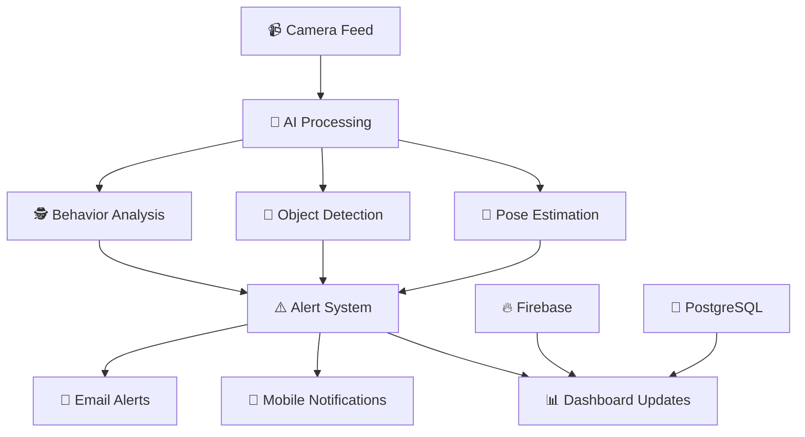

# 🛡️ SecureVista - AI-Driven Campus Surveillance System

<div align="center">


**Transform boring, passive CCTV systems into smart, real-time, AI-powered security networks!**

[🎯 Live Demo](https://lovable.dev/projects/dab2f711-e1a6-4668-8946-89157f2fe8a9) • [📖 Documentation](#) • [🐛 Report Bug](#-contact--feedback) • [💡 Request Feature](#-contact--feedback)

</div>

---

## 🚀 Overview

**SecureVista** revolutionizes campus security by turning traditional surveillance systems into intelligent, proactive guardians! 🤖✨

🎯 **What problem does it solve?**
- Traditional CCTV systems are reactive and require constant human monitoring
- Security threats often go undetected until it's too late
- Manual surveillance is expensive, prone to human error, and inefficient

🔥 **Why is it awesome?**
- **Real-time AI detection** of security threats and suspicious behavior
- **Automated alerts** sent instantly to security teams
- **Smart analytics** that learn and adapt to your environment
- **24/7 monitoring** without human fatigue or oversight gaps

---

## 🔧 Features

<details>
<summary>🎯 <strong>Core AI Detection Features</strong></summary>

### 🧠 Advanced AI Capabilities
- **📢 Real-Time Alerts** - Instant notifications for security events
- **🕵️‍♂️ Loitering Detection** - Identifies suspicious lingering behavior
- **🤕 Fall Detection** - Immediate alerts for medical emergencies
- **🧍‍♂️🪑 Pose Estimation** - Advanced human behavior analysis
- **🧳 Abandoned Object Monitoring** - Detects unattended bags/items
- **🎯 Object Detection with YOLOv8** - State-of-the-art computer vision
- **🧠 Behavior Tracking & Centroid-based Person ID** - Smart person tracking

</details>

<details>
<summary>📊 <strong>Analytics & Reporting</strong></summary>

### 📈 Smart Analytics Dashboard
- **📊 Automated Reporting** - Generate security reports automatically
- **📋 Real-time Analytics** - Live security metrics and insights
- **🎨 Interactive Dashboard** - Beautiful, responsive web interface
- **📱 Mobile Notifications** - Get alerts anywhere, anytime
- **📊 Data Visualization** - Charts, graphs, and heat maps

</details>

<details>
<summary>🔐 <strong>Security & Integration</strong></summary>

### 🛡️ Enterprise-Ready Security
- **🔒 Secure Authentication** - Multi-factor authentication support
- **🔥 Firebase Integration** - Reliable cloud infrastructure
- **📞 Twilio Alerts** - SMS and voice notifications
- **🐘 PostgreSQL Database** - Robust data storage and management
- **⚡ WebSocket Streaming** - Real-time video feeds

</details>

---

## 🧰 Tech Stack

<div align="center">

| Category | Technologies |
|----------|-------------|
| **🤖 AI/ML** |    |
| **⚡ Backend** |   |
| **🔥 Cloud** |   |
| **💻 Frontend** |    |
| **🔧 Tools** |   |

</div>

---

## 👥 Target Users

<div align="center">

### 🎯 Perfect for Organizations That Care About Security

| 🏫 **Schools & Colleges** | 🏢 **Corporate Offices** |
|:-------------------------:|:------------------------:|
| Campus safety monitoring | Employee security |
| Exam integrity tracking | Access control |
| Emergency response | Workplace safety |

| 🏥 **Hospitals** | 🏘️ **Residential Societies** |
|:----------------:|:----------------------------:|
| Patient safety | Community security |
| Staff monitoring | Visitor management |
| Emergency detection | Property protection |

</div>

---

## 🧠 How It Works

<details>
<summary>🔍 <strong>Click to see the magic behind SecureVista!</strong></summary>

### 🚀 AI Pipeline Architecture



### ⚡ Real-Time Processing
1. **📹 Video Capture** - Multiple camera feeds processed simultaneously
2. **🤖 AI Analysis** - YOLOv8 and MediaPipe working in harmony
3. **🧠 Smart Detection** - Multithreaded pipelines for real-time analysis
4. **📡 Live Streaming** - WebSocket-powered dashboard updates
5. **🚨 Instant Alerts** - Sub-second notification delivery

</details>

---

## 🛠️ Setup & Installation

<details>
<summary>🚀 <strong>Quick Start Guide</strong></summary>

### 📋 Prerequisites
```bash
# Install Python 3.8+
python --version

# Install Node.js 16+
node --version
```

### 🔧 Backend Setup
```bash
# Clone the repository
git clone <YOUR_GIT_URL>
cd SecureVista

# Create virtual environment
python -m venv venv
source venv/bin/activate  # On Windows: venv\Scripts\activate

# Install dependencies
pip install -r requirements.txt

# Set up environment variables
cp .env.example .env
# Edit .env with your Firebase and Twilio credentials
```

### 🎨 Frontend Setup
```bash
# Install frontend dependencies
npm install

# Start development server
npm run dev
```

### 🔥 Firebase Configuration
1. Create a Firebase project
2. Enable Authentication and Firestore
3. Add your config to `.env`
4. Initialize Firebase in your project

### 🚀 Launch the System
```bash
# Start backend server
python app.py

# Start frontend (in another terminal)
npm run dev

# Visit http://localhost:5173
```

</details>

---

## 📅 Roadmap

<div align="center">

### 🗺️ Our Journey to the Future

| Phase | Status | Features |
|-------|--------|----------|
| **🏗️ Phase 1** | ✅ **Complete** | Campus Safety MVP, Basic AI Detection |
| **🔬 Phase 2** | 🚧 **In Progress** | Exam Cheating Detection, Advanced Pose Estimation |
| **🔐 Phase 3** | 📋 **Planned** | Blockchain Identity System, Enhanced Privacy |
| **📈 Phase 4** | 🎯 **Vision** | Customer Growth Platform, Advanced Analytics |

### 🎯 Upcoming Features
- [ ] 👨‍🎓 **Exam Integrity Monitor** - AI-powered cheating detection
- [ ] 🔗 **Blockchain Identity** - Decentralized security verification
- [ ] 📊 **Advanced Analytics** - Predictive behavior modeling
- [ ] 🌐 **Multi-language Support** - Global accessibility
- [ ] 📱 **Mobile App** - On-the-go security management

</div>

---

## 🤝 Contributing

<details>
<summary>🎉 <strong>Join the SecureVista Community!</strong></summary>

### 🌟 How to Contribute

We love contributions! Here's how you can help make SecureVista even better:

#### 🚀 Quick Start
```bash
# 1. 🍴 Fork the repository
# 2. 📥 Clone your fork
git clone https://github.com/yourusername/SecureVista.git

# 3. 🌿 Create a feature branch
git checkout -b feature/amazing-new-feature

# 4. 💻 Make your changes
# 5. ✅ Test your changes
npm test

# 6. 📝 Commit your changes
git commit -m "✨ Add amazing new feature"

# 7. 🚀 Push to your branch
git push origin feature/amazing-new-feature

# 8. 🎯 Open a Pull Request
```

#### 🎯 Ways to Contribute
- 🐛 **Report Bugs** - Help us squash those pesky bugs!
- 💡 **Suggest Features** - Share your brilliant ideas!
- 📝 **Improve Documentation** - Make it easier for everyone!
- 🎨 **Design Improvements** - Make it more beautiful!
- 🧪 **Write Tests** - Help us maintain quality!

#### 📋 Contribution Guidelines
- Follow our coding standards
- Write descriptive commit messages
- Include tests for new features
- Update documentation as needed

</details>

---

## 📬 Contact / Feedback

<div align="center">

### 💬 We'd Love to Hear From You!

Got questions? Found a bug? Have a brilliant idea? We're all ears! 👂

[](mailto:team@securevista.com)
[](https://discord.gg/securevista)
[](https://twitter.com/securevista)
[](https://github.com/SecureVista/issues)

### 🌟 Show Your Support

If you find SecureVista helpful, please give us a ⭐ on GitHub!

[](https://github.com/SecureVista/SecureVista)
[](https://github.com/SecureVista/SecureVista)

</div>

---

<div align="center">

**🛡️ Protecting campuses, one AI detection at a time. 🤖**

Made with ❤️ by the SecureVista Team

[](https://github.com/SecureVista)
[](https://github.com/SecureVista)

</div>